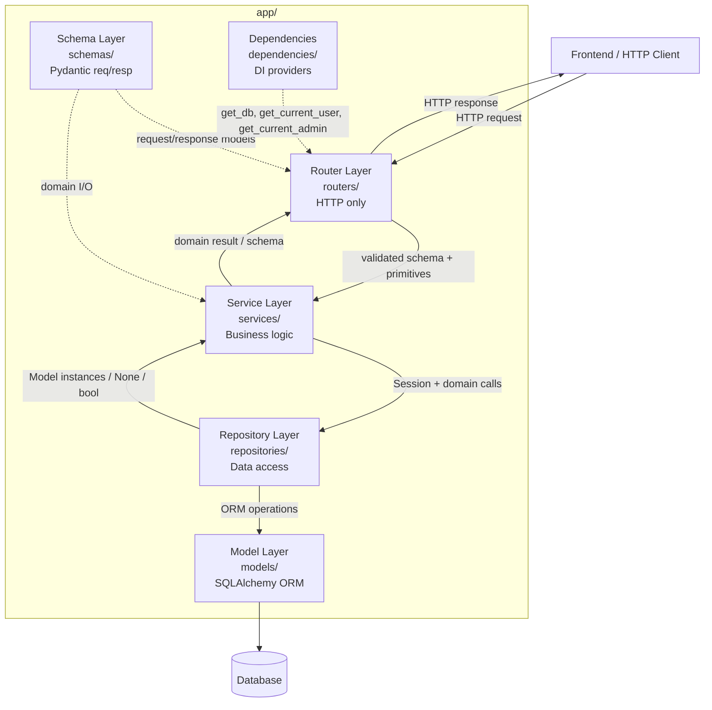

# Design Document

## Overview

Ushbu hujjat Designora onlayn ta'lim platformasining mavjud FastAPI backendini qatlamli (layered) arxitekturaga refaktoring qilishning texnik dizaynini belgilaydi. Talablar hujjatida (requirements.md) aniqlangan to'qqizta talabni amalga oshirish uchun aniq, bosqichma-bosqich va regressiyasiz (no behavior regression) yondashuv taqdim etiladi.

### Maqsadlar (Goals)

- **Mas'uliyatlarni ajratish (Separation of Concerns):** HTTP ishlash logikasi (`routers/`), biznes-mantiq (`services/`), ma'lumotlarga kirish (`repositories/`), validatsiya schema'lari (`schemas/`) va dependency injection (`dependencies/`) qatlamlarini bir-biridan ajratish. (Requirements 1, 2, 3, 4, 5)
- **Sinovga yaroqlilik (Testability):** Service qatlamini mock/fake repository bilan, repository qatlamini esa in-memory SQLAlchemy Session bilan mustaqil sinovdan o'tkazish imkonini yaratish. (Requirement 8)
- **Takrorlanishni bartaraf etish:** `main.py` dagi `_require_admin` va `admin_courses.py` dagi `require_admin` dublikatlarini yagona `get_current_admin` dependency bilan almashtirish. (Requirement 5)
- **Domen qoidalarini saqlash:** Streak hisoblash, points/sertifikat berish, progress clamping va role-based redirect mantig'ini aynan hozirgidek qoldirish. (Requirement 7)

### Doiraga kirmaydi (Non-Goals / Scope)

- Faqat **backend** (`backend/app/`) refaktor qilinadi. Frontend (React) o'zgartirilmaydi.
- **Database schema o'zgartirilmaydi.** `app/alembic/versions/` jildidagi birorta fayl qo'shilmaydi, o'chirilmaydi yoki o'zgartirilmaydi. Alembic autogenerate nol (0) ta operatsiya hosil qilishi shart. (Requirement 9.2, 9.8)
- ORM modellari (`app/models/`) **hozirgi joylarida** qoladi va import yo'llari o'zgarmaydi, chunki `app/alembic/env.py` ularni shu yo'llardan resolve qiladi. (Requirement 9.3)
- Yangi funksionallik qo'shilmaydi; mavjud xulq-atvor 1:1 saqlanadi.

### No-Regression tamoyili (asosiy cheklov)

Refaktoringning markaziy mas'uliyati — **kuzatiladigan xulq-atvorni o'zgartirmaslik**. Quyidagilar aynan saqlanadi:

- Barcha endpoint yo'llari, HTTP metodlari, status kodlari va JSON javob maydon nomlari/ichki tuzilmasi. (Requirement 6.1–6.4)
- Auth cookie xulqi: nomi `access_token`, `httponly`, `samesite=strict`, `max_age=3600`, `secure` faqat production'da. (Requirement 6.5)
- Rate limiting (login `5/minute`), CSRF (faqat production), reCAPTCHA (faqat production), security headerlar. (Requirement 6.6–6.9)
- `/api/me` → `/api/profile/me` 307 redirect va global exception handler xulqi. (Requirement 6.1)

> **Diqqat — avtorizatsiya semantikasi (deliberate preservation):** `utils/routes.py` dagi `is_admin_role()` redirect maqsadida ham `admin`, ham `superadmin` rolini admin deb hisoblaydi. Biroq hozirgi admin guard'lar (`main.py::_require_admin` va `admin_courses.py::require_admin`) faqat `role == "admin"` ni tekshiradi. Bu shuni anglatadiki, `superadmin` foydalanuvchi `/manage/courses` ga redirect qilinadi, lekin admin API endpointlarida 403 oladi. **Bu nomuvofiqlik ataylab aynan saqlanadi.** Yangi `get_current_admin` dependency `is_admin_role()` emas, balki qat'iy `role == "admin"` shartini ishlatadi. Avtorizatsiya semantikasini "jimgina to'g'rilash" man etiladi — bu alohida talab/qaror sifatida ko'rib chiqilishi kerak.

## Architecture

### Qatlamli arxitektura (Layered Architecture)

Refaktoringdan keyingi so'rov oqimi (request flow) quyidagicha bir yo'nalishli (top-down) bog'liqlikka ega bo'ladi. `schemas/` va `dependencies/` qatlamlari ko'ndalang (cross-cutting) — ular bir nechta qatlam tomonidan ishlatiladi.



### Bog'liqlik qoidalari (Dependency Rules)

- **Router → Service → Repository → Model** yagona yo'nalishda. Teskari bog'liqlik yo'q.
- **Router** faqat HTTP bilan ishlaydi: so'rovni parse qilish/validatsiya (schema orqali), service/repository chaqirish, HTTP javob qurish. To'g'ridan-to'g'ri `db.query`, `db.add`, `db.commit`, `db.refresh`, `db.delete` chaqiruvlari **bo'lmaydi**. (Requirement 1.3, 1.5)
- **Service** biznes-mantiqni saqlaydi, `Request`/`Response` kabi HTTP obyektlarini parametr sifatida olmaydi, ma'lumotlarga faqat Repository orqali kiradi (to'g'ridan-to'g'ri SQLAlchemy chaqiruvlari yo'q). (Requirement 3.2, 3.4)
- **Repository** `Session` ni parametr sifatida qabul qiladi, o'zi Session ochmaydi/yopmaydi, `HTTPException`/`Request`/`Response` kabi HTTP obyektlarini saqlamaydi. (Requirement 4.2, 4.5)
- **Schema** ORM modellaridan alohida modullarda. **Dependencies** har bir umumiy dependency ni aynan bir marta belgilaydi. (Requirement 2.4, 5.5)

### Yangi katalog tuzilmasi (`app/` ostida)

```
app/
├── main.py                      # router registration (thinned admin block)
├── dependencies/                # YANGI — markazlashtirilgan DI
│   ├── __init__.py
│   └── deps.py                  # get_db (re-export), get_current_user (re-export), get_current_admin
├── schemas/                     # YANGI — Pydantic request/response modellari
│   ├── __init__.py
│   ├── auth.py                  # RegisterRequest, LoginRequest, ForgotPasswordRequest, ResetPasswordRequest
│   ├── profile.py               # ProfileResponse, ProfileUpdateRequest, ChangePasswordRequest, ProgressUpdateRequest
│   └── course.py                # CourseCreate, CourseUpdate
├── repositories/                # YANGI — ma'lumotlarga kirish
│   ├── __init__.py
│   ├── user_repository.py
│   ├── course_repository.py
│   ├── progress_repository.py
│   ├── certificate_repository.py
│   ├── assignment_repository.py
│   ├── notification_repository.py
│   ├── payment_repository.py
│   └── password_reset_repository.py
├── services/                    # YANGI — biznes-mantiq
│   ├── __init__.py
│   ├── auth_service.py          # register, authenticate, streak, password-reset, redirect
│   ├── profile_service.py       # profile get/update, change-password, stats, progress update
│   └── course_service.py        # course CRUD + admin user listing
├── routers/                     # MAVJUD — endi "thin" (faqat HTTP)
│   ├── auth.py
│   ├── google.py
│   ├── profile.py
│   ├── admin_courses.py
│   ├── users.py
│   └── pages.py
├── core/                        # MAVJUD — o'zgarmaydi (admin_guard.py deprecate qilinadi)
│   ├── config.py
│   ├── database.py
│   ├── security.py
│   ├── password.py
│   ├── email.py
│   ├── logger.py
│   ├── middleware.py
│   └── admin_guard.py           # mavjud, lekin endi dependencies.deps ga delegatsiya qiladi
├── models/                      # MAVJUD — JOYI O'ZGARMAYDI (alembic/env.py resolve qiladi)
│   ├── user.py, Course.py, progress.py, certificate.py, assignment.py,
│   ├── notification.py, payment.py, password_reset.py, lesson.py
│   └── __init__.py
├── admin/                       # MAVJUD — sqladmin (o'zgarmaydi)
└── alembic/                     # MAVJUD — TEGILMAYDI (versions/ o'zgarmaydi)
```

> Eslatma: modellar `app/models/` da qoladi va relationshiplar string-reference orqali ishlagani uchun import tartibi muammosi tug'ilmaydi. `app/alembic/env.py` import yo'llari saqlanadi. (Requirement 9.2, 9.3, 9.4)

## Components and Interfaces

Quyida har bir qatlam komponentlari va ularning interfeyslari batafsil keltiriladi. Signaturalar Python type-hint uslubida ko'rsatilgan; ular mavjud koddagi xulqni aynan inkapsulyatsiya qiladi.

### 1. Schema Layer (`app/schemas/`)

Hozirda router fayllari ichida inline e'lon qilingan barcha Pydantic modellari ko'chiriladi. Maydon nomlari, turlari, optional/required holati, default qiymatlar va validatorlar **harf-baharf saqlanadi**. (Requirement 2.1, 2.6)

**`app/schemas/auth.py`** (manba: `routers/auth.py`)

```python
class RegisterRequest(BaseModel):
    username: Annotated[str, StringConstraints(min_length=3, max_length=50)]
    email: EmailStr
    password: Annotated[str, StringConstraints(min_length=8, max_length=128)]
    recaptcha_token: str
    # @field_validator("password") password_strength: >=1 katta harf, >=1 raqam

class LoginRequest(BaseModel):
    email: EmailStr
    password: Annotated[str, StringConstraints(min_length=8, max_length=128)]
    recaptcha_token: Optional[str] = None

class ForgotPasswordRequest(BaseModel):
    email: EmailStr

class ResetPasswordRequest(BaseModel):
    token: str
    password: Annotated[str, StringConstraints(min_length=8, max_length=128)]
    # @field_validator("password") password_strength: >=1 katta harf, >=1 raqam
```

**`app/schemas/profile.py`** (manba: `routers/profile.py`)

```python
class ProfileResponse(BaseModel):
    id: int
    name: str
    email: str
    role: str
    provider: Optional[str] = "local"
    is_active: bool = True
    created_at: Optional[datetime] = None
    bio: Optional[str] = None
    phone: Optional[str] = None
    location: Optional[str] = None
    website: Optional[str] = None
    avatar_url: Optional[str] = None
    # class Config: from_attributes = True   (Requirement 2.5)

class ProfileUpdateRequest(BaseModel):
    name: Annotated[str, StringConstraints(min_length=2, max_length=100)]
    bio: Optional[Annotated[str, StringConstraints(max_length=500)]] = None
    phone: Optional[Annotated[str, StringConstraints(max_length=20)]] = None
    location: Optional[Annotated[str, StringConstraints(max_length=100)]] = None
    website: Optional[Annotated[str, StringConstraints(max_length=200)]] = None

class ChangePasswordRequest(BaseModel):
    current_password: Annotated[str, StringConstraints(min_length=8, max_length=128)]
    new_password: Annotated[str, StringConstraints(min_length=8, max_length=128)]
    # @field_validator("new_password") password_strength: >=1 katta harf, >=1 raqam

class ProgressUpdateRequest(BaseModel):
    percent: int
    minutes_spent: Optional[int] = 0
```

**`app/schemas/course.py`** (manba: `routers/admin_courses.py`)

```python
class CourseCreate(BaseModel):
    title: Annotated[str, StringConstraints(min_length=3, max_length=200)]
    description: Optional[str] = None
    category: Optional[str] = None
    price: Optional[int] = 0
    thumbnail_url: Optional[str] = None
    is_active: Optional[bool] = True

class CourseUpdate(BaseModel):
    title: Optional[Annotated[str, StringConstraints(min_length=3, max_length=200)]] = None
    description: Optional[str] = None
    category: Optional[str] = None
    price: Optional[int] = None
    thumbnail_url: Optional[str] = None
    is_active: Optional[bool] = None
```

> Router'lar bu modellarni `app/schemas/` dan import qiladi va inline `class ...(BaseModel)` e'lonlarini saqlamaydi. (Requirement 2.2, 2.3)

### 2. Repository Layer (`app/repositories/`)

Har bir repository `Session` ni birinchi parametr sifatida oladi, Model instance / `None` / `bool` / kolleksiya qaytaradi, HTTP obyektlari saqlamaydi. Commit/rollback **service qatlami** tomonidan boshqariladi; repository faqat `add`/`flush`/`delete`/`query` bajaradi (commit semantikasi pastda "Transaction handling" da tushuntiriladi). (Requirement 4.1–4.8)

**`user_repository.py`**

```python
def get_by_email(db: Session, email: str) -> User | None
def get_by_id(db: Session, user_id: int) -> User | None
def list_all(db: Session) -> list[User]                       # User.id.desc() tartibida
def add(db: Session, user: User) -> User                      # db.add + flush; commit service'da
def exists_by_email(db: Session, email: str) -> bool
```

**`course_repository.py`**

```python
def get_by_id(db: Session, course_id: int) -> Course | None
def get_active_by_id(db: Session, course_id: int) -> Course | None   # is_active == True
def list_all(db: Session) -> list[Course]                            # Course.id.desc()
def add(db: Session, course: Course) -> Course
def delete(db: Session, course: Course) -> bool                      # True agar o'chirildi
```

**`progress_repository.py`**

```python
def get_for_user_course(db: Session, user_id: int, course_id: int) -> Progress | None
def list_with_courses_for_user(db: Session, user_id: int) -> list[tuple[Progress, Course]]
    # Progress JOIN Course (Progress.course_id == Course.id) WHERE user_id
def sum_minutes_for_user(db: Session, user_id: int) -> int           # func.sum(minutes_spent) or 0
def sum_minutes_in_range(db: Session, user_id: int, start, end) -> int
def add(db: Session, progress: Progress) -> Progress
```

**`certificate_repository.py`**

```python
def get_for_user_course(db: Session, user_id: int, course_id: int) -> Certificate | None
def count_for_user(db: Session, user_id: int) -> int
def add(db: Session, cert: Certificate) -> Certificate
```

**`assignment_repository.py`**

```python
def count_pending_for_user(db: Session, user_id: int) -> int         # is_completed == False
```

**`password_reset_repository.py`**

```python
def get_valid_by_token(db: Session, token: str) -> PasswordReset | None   # expires_at > now(utc)
def delete_for_user(db: Session, user_id: int) -> int                     # eski tokenlarni o'chirish
def add(db: Session, reset: PasswordReset) -> PasswordReset
def delete(db: Session, reset: PasswordReset) -> bool
```

**`notification_repository.py`** va **`payment_repository.py`**

Requirement 4.1 ushbu entity'lar uchun ham data-access inkapsulyatsiyasini talab qiladi. Hozirgi router'lar bu modellarga to'g'ridan-to'g'ri murojaat qilmaydi (faqat `admin/` sqladmin view'lari ishlatadi), shu sababli bu repository'lar yagona standart CRUD interfeysini taqdim etadi va kelajakdagi foydalanish uchun tayyor turadi:

```python
# notification_repository.py
def get_by_id(db, notification_id) -> Notification | None
def list_for_user(db, user_id) -> list[Notification]
def add(db, notification) -> Notification

# payment_repository.py
def get_by_id(db, payment_id) -> Payment | None
def list_for_user(db, user_id) -> list[Payment]
def add(db, payment) -> Payment
```

> `admin/` (sqladmin) view'lari o'z ModelView mexanizmidan foydalanadi va bu refaktoring doirasidan tashqarida — o'zgarmaydi.

### 3. Service Layer (`app/services/`)

Service funksiyalari domain inputlar (schema modellari yoki primitivlar) qabul qiladi, domain natija yoki schema qaytaradi. HTTP obyektlarini olmaydi. Transaction commit nuqtasi hozirgi kod bilan aynan bir xil saqlanadi. (Requirement 3.1–3.6, 7.1–7.7)

**`auth_service.py`**

```python
def register_user(db: Session, data: RegisterRequest) -> User
    # exists_by_email tekshiruvi → DuplicateEmailError; hash_password; user_repo.add; commit

def authenticate_user(db: Session, email: str, password: str) -> User
    # user_repo.get_by_email; verify_password; xato → InvalidCredentialsError

def update_streak(db: Session, user: User) -> None
    # Requirement 7.1, 7.2 — UTC sana taqqoslash mantig'i (pastda Data/Domain qoidalari)

def create_password_reset(db: Session, email: str) -> PasswordReset | None
    # user yo'q → None (timing-safe SAME_RESPONSE router'da); eski tokenlarni o'chirish;
    # uuid4 token; reset.add; commit

def reset_password(db: Session, token: str, new_password: str) -> User
    # password_reset_repo.get_valid_by_token; yo'q → InvalidTokenError;
    # user yo'q → UserNotFoundError; hash_password; reset.delete; commit

def redirect_target_for_role(role: str | None) -> str
    # dashboard_path_for_role(role) ni qayta ishlatadi (Requirement 7.7)
```

> Eslatma: reCAPTCHA va CSRF tekshiruvlari **router** qatlamida qoladi, chunki ular `Request`/async HTTP bilan bog'liq (CSRF `Request` obyektini, reCAPTCHA esa tashqi HTTP chaqiruvni talab qiladi). Bu Requirement 1.3 (a) doirasidagi "request parsing/validatsiya" hisoblanadi va Requirement 6.7, 6.8 xulqini saqlaydi. Service faqat sof biznes-mantiqni oladi.

**`profile_service.py`**

```python
def get_profile(db: Session, email: str) -> ProfileResponse
    # user_repo.get_by_email; yo'q → UnauthorizedError; ProfileResponse qurish (getattr default'lar bilan)

def update_profile(db: Session, email: str, data: ProfileUpdateRequest) -> User
    # name + bo'sh bo'lmagan maydonlarni yangilash; commit/rollback

def change_password(db: Session, email: str, data: ChangePasswordRequest) -> None
    # provider != "local" → ProviderError; parol yo'q → NoPasswordError;
    # joriy noto'g'ri → InvalidCurrentPasswordError; yangi == joriy → SamePasswordError; commit

def get_stats(db: Session, email: str) -> dict
    # progress_repo, certificate_repo, assignment_repo orqali statistikani yig'ish;
    # 7 kunlik activity; JSON struktura aynan saqlanadi

def update_progress(db: Session, email: str, course_id: int, data: ProgressUpdateRequest) -> dict
    # Requirement 7.3–7.6 — sertifikat/points/clamp mantig'i (pastda batafsil)
```

**`course_service.py`**

```python
def list_courses(db: Session) -> list[dict]                          # admin kurslar ro'yxati
def create_course(db: Session, data: CourseCreate, instructor_id: int) -> Course
def update_course(db: Session, course_id: int, data: CourseUpdate) -> Course   # yo'q → NotFoundError
def delete_course(db: Session, course_id: int) -> bool
def toggle_course(db: Session, course_id: int) -> Course
def list_admin_users(db: Session) -> list[dict]                      # /api/admin/users uchun
```

### 4. Dependency Layer (`app/dependencies/deps.py`)

Yagona, markazlashtirilgan DI moduli. (Requirement 5.1–5.8)

```python
from app.core.database import get_db            # re-export: bir so'rovga bitta Session, finally'da yopiladi
from app.core.security import get_current_user  # re-export: email identity yoki 401

def get_current_admin(
    email: str = Depends(get_current_user),
    db: Session = Depends(get_db),
) -> User:
    user = user_repository.get_by_email(db, email)
    if not user or user.role != "admin":        # AYNAN hozirgi semantika (faqat "admin")
        raise HTTPException(status_code=403, detail="Faqat adminlar uchun")
    return user
```

- `get_db` — `core/database.py` dagi mavjud generatorni re-export qiladi: bir so'rovga bitta Session yaratadi va `finally` blokida yopadi. (Requirement 5.1, 5.6)
- `get_current_user` — `core/security.py` dagi mavjud funksiyani re-export qiladi: session/cookie/Authorization/X-Access-Token dan email aniqlaydi, aks holda 401. (Requirement 5.2, 5.7)
- `get_current_admin` — `main.py::_require_admin` va `admin_courses.py::require_admin` o'rnini bosadi. Yagona ta'rif. (Requirement 5.3, 5.4, 5.5, 5.8)

> `core/admin_guard.py::admin_required` ham mavjud (lekin hech qaerda ishlatilmagan). U `dependencies.deps.get_current_admin` ga delegatsiya qiladigan ingichka wrapper'ga aylantiriladi yoki shu funksiyani import qiladi — natijada yagona manba (single source of truth) ta'minlanadi.

### Endpointlarning router → service → repository ga moslashuvi

Quyidagi jadval har bir mavjud endpoint qanday qatlamlarga taqsimlanishini ko'rsatadi. **Yo'l, metod, status kodi va javob tuzilmasi o'zgarmaydi.** (Requirement 6.1–6.4)

| Endpoint (metod) | Router mas'uliyati | Service chaqiruvi | Repository |
|---|---|---|---|
| `POST /api/auth/register` | reCAPTCHA tekshirish, schema validatsiya, cookie o'rnatish, JSON qurish | `auth_service.register_user` | `user_repository` |
| `POST /api/auth/login` | rate-limit `5/minute`, CSRF (prod), reCAPTCHA, cookie, JSON | `auth_service.authenticate_user` + `update_streak` | `user_repository` |
| `GET /api/auth/csrf-token` | CSRF token generatsiya/cookie | — (HTTP only) | — |
| `POST /api/auth/logout` | cookie o'chirish, session clear, redirect | — | — |
| `POST /api/auth/forgot-password` | SAME_RESPONSE, email yuborish | `auth_service.create_password_reset` | `password_reset_repository`, `user_repository` |
| `POST /api/auth/reset-password` | cookie, JSON | `auth_service.reset_password` | `password_reset_repository`, `user_repository` |
| `GET /login`, `GET /reset-password` | redirect/template (HTML) | `auth_service.redirect_target_for_role` (login) | `user_repository` |
| `GET /api/profile/me` | schema response | `profile_service.get_profile` | `user_repository` |
| `PATCH /api/profile/update` | schema validatsiya, JSON | `profile_service.update_profile` | `user_repository` |
| `POST /api/profile/change-password` | schema validatsiya, JSON | `profile_service.change_password` | `user_repository` |
| `GET /api/profile/stats` | JSON | `profile_service.get_stats` | `progress`, `certificate`, `assignment`, `user` repos |
| `PATCH /api/profile/progress/{course_id}` | schema validatsiya, JSON | `profile_service.update_progress` | `course`, `progress`, `certificate`, `user` repos |
| `GET /api/admin/courses` | JSON, admin guard | `course_service.list_courses` | `course_repository` |
| `POST /api/admin/courses` | 201, JSON, admin guard | `course_service.create_course` | `course_repository` |
| `PATCH /api/admin/courses/{id}` | JSON, admin guard | `course_service.update_course` | `course_repository` |
| `DELETE /api/admin/courses/{id}` | JSON, admin guard | `course_service.delete_course` | `course_repository` |
| `PATCH /api/admin/courses/{id}/toggle` | JSON, admin guard | `course_service.toggle_course` | `course_repository` |
| `GET /api/admin/courses/api/admin/users` (410 Gone) | mavjud xulq aynan saqlanadi | — | — |
| `GET /api/admin/users` (main.py) | JSON, admin guard | `course_service.list_admin_users` | `user_repository` |
| `GET /api/dashboard` | 307 → `/api/profile/stats` | — | — |
| `GET /api/me` | 307 → `/api/profile/me` | — | — |
| `GET /auth/google`, `GET /auth/google/callback` | OAuth flow, cookie, redirect | `auth_service` (user upsert + redirect) | `user_repository` |
| `pages.py` HTML route'lar | template render + redirect | (kerak bo'lsa) profile/course service | `user`, `course`, `progress` repos |

> `pages.py` va `google.py` HTML/OAuth bilan ishlovchi maxsus route'lar. Ular Requirement 1.4 ostida "redirect-only / template-only" handler sifatida ko'rib chiqiladi: HTTP bo'lmagan data-access ularda repository'ga ko'chiriladi, lekin OAuth va template render router'da qoladi.

## Data Models

### ORM modellari joyida qoladi (`app/models/`)

SQLAlchemy ORM modellari refaktoring davomida **ko'chirilmaydi** va import yo'llari o'zgarmaydi. Sabab: `app/alembic/env.py` modellarni aniq yo'llardan import qiladi (`from models.user import User` va h.k.) va `Base.metadata` ni autogenerate uchun shu yo'l orqali yig'adi. Modellarni ko'chirish Alembic'ni buzadi va Requirement 9.3, 9.4 ni buzgan bo'lar edi. Shu sababli `models/` va `core/database.py::Base` o'z joyida turadi; refaktoring faqat ularning **ustiga** yangi qatlamlar qo'shadi. (Requirement 9.2, 9.3, 9.8)

Mavjud ORM modellari va ulardan foydalanadigan repository'lar:

| Model | Jadval | Asosiy maydonlar (refaktorda foydalaniladigan) | Repository |
|---|---|---|---|
| `User` | `users` | `id, email, name, password, role, provider, is_active, points, streak_days, last_login_date, level, bio, phone, location, website, avatar_url, created_at` | `user_repository` |
| `Course` | `courses` | `id, title, description, category, price, is_active, thumbnail_url, instructor_id` | `course_repository` |
| `Progress` | `progress` | `id, user_id, course_id, percent, minutes_spent, last_activity, updated_at` | `progress_repository` |
| `Certificate` | `certificates` | `id, user_id, course_id, title, issued_at` | `certificate_repository` |
| `Assignment` | `assignments` | `id, user_id, course_id, title, is_completed, due_date, created_at` | `assignment_repository` |
| `Notification` | `notifications` | `id, user_id, message, type, link, is_read, created_at` | `notification_repository` |
| `Payment` | `payments` | `id, user_id, course_id, amount, status, provider, created_at, updated_at` | `payment_repository` |
| `PasswordReset` | `password_resets` | `id, user_id, token, expires_at` (+ `expiry()` staticmethod) | `password_reset_repository` |

> `Lesson` modeli ham mavjud (`Course.lessons` relationship uchun shart) va `models/__init__.py` orqali import qilinadi; u refaktorda alohida repository talab qilmaydi, lekin modellar yaxlitligi uchun joyida qoladi.

### Schema modellari ORM'dan ajratiladi (`app/schemas/`)

Schema qatlami ORM modellaridan **alohida** modullarda joylashadi (Requirement 2.4). Schema'lar router'lardagi inline Pydantic modellarini maydon-baholan aks ettiradi (Requirement 2.6). To'liq inventar:

**Auth schemas** (`schemas/auth.py`): `RegisterRequest`, `LoginRequest`, `ForgotPasswordRequest`, `ResetPasswordRequest`
**Profile schemas** (`schemas/profile.py`): `ProfileResponse` (`from_attributes = True`), `ProfileUpdateRequest`, `ChangePasswordRequest`, `ProgressUpdateRequest`
**Course schemas** (`schemas/course.py`): `CourseCreate`, `CourseUpdate`

Saqlanadigan validatsiya cheklovlari (Requirement 2.6 — har biri aynan saqlanadi):

- `username`: `StringConstraints(min_length=3, max_length=50)`
- `email`: `EmailStr`
- `password` / `new_password`: `StringConstraints(min_length=8, max_length=128)` + `password_strength` validator (kamida 1 ta katta harf, kamida 1 ta raqam)
- `ProfileUpdateRequest.name`: `StringConstraints(min_length=2, max_length=100)`; `bio`≤500, `phone`≤20, `location`≤100, `website`≤200
- `CourseCreate.title` / `CourseUpdate.title`: `StringConstraints(min_length=3, max_length=200)`
- `ProgressUpdateRequest`: `percent: int`, `minutes_spent: Optional[int] = 0`

### Domen biznes-qoidalari (service qatlamida saqlanadi)

Quyidagi qoidalar mavjud koddan aynan ko'chiriladi va service qatlamida markazlashtiriladi. (Requirement 7)

**Streak hisoblash (`auth_service.update_streak`)** — UTC sana taqqoslash (Requirement 7.1, 7.2):

1. `last_login_date` mavjud bo'lsa, uning UTC `.date()` qismi olinadi; aks holda `None`.
2. `last_date is None` → `streak_days = 1`
3. `last_date == today` (bir xil UTC sana) → o'zgarishsiz
4. `last_date == today - 1 kun` (aniq oldingi kun) → `streak_days += 1`
5. aks holda (uzilish) → `streak_days = 1`
6. So'ngra `last_login_date = datetime.now(timezone.utc)`; commit.

**Progress / sertifikat / points (`profile_service.update_progress`)** (Requirement 7.3–7.6):

1. Kurs `is_active == True` bo'lishi shart; topilmasa 404 (router translate qiladi).
2. Progress yozuvi yo'q bo'lsa, `percent=0, minutes_spent=0` bilan yangi yozuv yaratiladi (Requirement 7.5).
3. `percent = min(max(data.percent, 0), 100)` — 0..100 oralig'iga clamp (Requirement 7.6).
4. `minutes_spent += (data.minutes_spent or 0)` — null → 0.
5. `percent >= 100` VA shu user/course uchun sertifikat **yo'q** bo'lsa: aynan **1 ta** `Certificate` yaratiladi va `points += 100 + (session minutes_spent or 0)` — **faqat bir marta** (Requirement 7.3).
6. Sertifikat allaqachon mavjud bo'lsa yoki `percent < 100` bo'lsa: `points += (session minutes_spent or 0)`, sertifikat yaratilmaydi (Requirement 7.4).
7. So'ngra commit (rollback on failure).

**Role-based redirect (`auth_service.redirect_target_for_role`)** (Requirement 7.7): `utils/routes.py::dashboard_path_for_role` qayta ishlatiladi — admin rollar `{admin, superadmin}` → `/manage/courses`, qolganlar → `/dashboard`. (Bu redirect maqsadidagi mavjud `is_admin_role` semantikasini saqlaydi; admin **guard** esa alohida — faqat `role == "admin"`.)

## Correctness Properties

*A property is a characteristic or behavior that should hold true across all valid executions of a system — essentially, a formal statement about what the system should do. Properties serve as the bridge between human-readable specifications and machine-verifiable correctness guarantees.*

Ushbu refaktoring asosan tuzilmaviy (structural) bo'lgani uchun ko'p talablar smoke/integration/contract testlari bilan qoplanadi (Error Handling va Testing Strategy bo'limlariga qarang). Quyidagi property'lar esa **sof domen-mantiq** va **regressiyasizlik invariantlari** uchun yozilgan — ular keng input fazosida universal ravishda ushlanishi kerak va property-based testing uchun mos.

**Property Reflection (redundancy bartaraf etish):**
- Requirement 3.3 ("biznes-mantiq aynan bir marta bajariladi") alohida property emas — u **Property 2** (sertifikat/points aynan bir marta) ichida to'liq qamrab olingan.
- Requirement 7.5 (Progress auto-create) alohida property emas — u **Property 2** ichida (progress update mantig'ining bir qismi sifatida) tekshiriladi.
- Requirement 4.3/4.4/4.6/4.7 alohida emas — yagona **Property 7** (repository qaytarish-shakli va round-trip kontrakti) ga birlashtirildi.
- Requirement 6.1–6.4 va 9.5 o'zaro bog'liq: 6.1–6.4 javob tuzilmasi/statusni, 9.5 esa yo'l mavjudligini tekshiradi. Ular **Property 8** (API kontrakt saqlanishi) va **Property 10** (route reachability) sifatida ajratildi, chunki birinchisi javob shaklini, ikkinchisi marshrut jadvalini tekshiradi — turli verifikatsiya.

---

### Property 1: Streak state transition (UTC sana mantig'i)

*For any* foydalanuvchi holati — ya'ni ixtiyoriy `last_login_date` (jumladan `null`) va ixtiyoriy joriy `streak_days` qiymati uchun — `update_streak` chaqirilgandan so'ng `streak_days` quyidagi to'rt holatga aynan mos bo'lishi kerak: (a) `last_login_date is null` → `streak_days == 1`; (b) saqlangan sana joriy UTC sana bilan bir xil → `streak_days` o'zgarmaydi; (c) saqlangan sana aniq 1 kun oldin → `streak_days` aynan 1 ga ortadi; (d) aks holda (≥2 kun uzilish) → `streak_days == 1`. Har holatda `last_login_date` joriy UTC vaqtga o'rnatilishi shart.

**Validates: Requirements 7.1, 7.2**

### Property 2: Certificate va points aynan bir marta beriladi (exactly-once awarding)

*For any* boshlang'ich progress holati (mavjud yoki mavjud emas), ixtiyoriy `percent` (manfiy, 0..100, >100) va ixtiyoriy `minutes_spent` (`null`/manfiy → 0 deb qabul qilinadi) uchun, `update_progress` chaqirilganda: progress yozuvi yo'q bo'lsa avval `percent=0, minutes_spent=0` bilan yaratiladi; agar yangi `percent >= 100` VA shu user/course uchun sertifikat mavjud bo'lmasa — **aynan bitta** `Certificate` yaratiladi va `points` aynan `100 + session_minutes` ga ortadi; aks holda (sertifikat allaqachon mavjud yoki `percent < 100`) — `points` faqat `session_minutes` ga ortadi va yangi sertifikat **yaratilmaydi**. Invariant: har bir (user, course) juftligi uchun ko'pi bilan bitta sertifikat bo'ladi va 100 ballik bonus aynan bir marta beriladi (idempotentlik: `>= 100` da takroriy chaqiruv ikkinchi sertifikat yaratmaydi va 100 ni qayta bermaydi).

**Validates: Requirements 7.3, 7.4, 7.5, 3.3**

### Property 3: Percent clamping invariant

*For any* butun son `percent` qiymati (manfiy, 0..100 oralig'i, 100 dan katta, juda katta) uchun, `update_progress` saqlagan `percent` har doim `[0, 100]` yopiq oralig'ida bo'lishi va aynan `min(max(percent, 0), 100)` ga teng bo'lishi kerak.

**Validates: Requirements 7.6**

### Property 4: Role-based redirect target

*For any* rol satri (jumladan `"admin"`, `"superadmin"`, harf registri aralash variantlar, `None`, va ixtiyoriy boshqa satrlar) uchun, `redirect_target_for_role` natijasi: agar normallashtirilgan rol `{admin, superadmin}` to'plamida bo'lsa `/manage/courses`, aks holda `/dashboard` bo'lishi kerak. Natija doim shu ikki qiymatdan biri bo'ladi.

**Validates: Requirements 7.7**

### Property 5: Schema validatsiya accept/reject invariantligi

*For any* nomzod so'rov payload'i uchun, ko'chirilgan Schema_Layer modeli payload'ni refaktoringdan oldingi inline model bilan **aynan bir xil** qabul qiladi yoki rad etadi. Xususan: `StringConstraints` min/max chegaralarini buzgan har qanday satr, yaroqsiz `EmailStr`, yoki `password_strength` ni buzgan (katta harfsiz yoki raqamsiz) har qanday parol rad etiladi; barcha cheklovlarni qondiradigan har qanday payload qabul qilinadi. Rad etilgan payload uchun Service_Layer chaqirilmaydi.

**Validates: Requirements 2.6, 2.7**

### Property 6: Multi-step write — commit-once / rollback-on-failure

*For any* ko'p qadamli yozuv operatsiyasi (register, reset-password, progress-completion) uchun: agar barcha qadamlar muvaffaqiyatli bo'lsa, tranzaksiya aynan bir marta commit qilinadi; agar biror yozuv xato bersa, tranzaksiya rollback qilinadi va hech qanday qisman (partial) yozuv saqlanib qolmaydi (operatsiyadan oldingi va keyingi saqlangan holat o'zgarishsiz).

**Validates: Requirements 3.5, 3.6**

### Property 7: Repository qaytarish-shakli va round-trip kontrakti

*For any* entity va ixtiyoriy kalit uchun, in-memory Session bilan: (a) mavjud bo'lmagan `id`/`email`/`token` bo'yicha get → `None`; (b) qo'shilgandan keyin xuddi shu kalit bo'yicha get ekvivalent Model instance qaytaradi (add→get round-trip); (c) hech qanday mos qator bo'lmaganda kolleksiya o'qish bo'sh kolleksiya qaytaradi; (d) delete mavjud qatorda `True`, mavjud bo'lmaganda `False` qaytaradi; (e) create/update persist qilingan instance qaytaradi (update nishoni yo'q bo'lsa `None`).

**Validates: Requirements 4.3, 4.4, 4.6, 4.7**

### Property 8: API kontrakt saqlanishi (javob tuzilmasi va status)

*For any* hujjatlashtirilgan endpoint va unga mos so'rov (muvaffaqiyatli va xato holatlar) uchun, refaktoringdan keyingi javobning HTTP status kodi va JSON maydon nomlari/ichki tuzilmasi refaktoringdan oldingi golden (snapshot) kontrakt bilan **aynan teng** bo'lishi kerak — qiymat farqlari faqat deterministik bo'lmagan maydonlar (`access_token`, timestamplar) uchun ruxsat etiladi.

**Validates: Requirements 6.1, 6.2, 6.3, 6.4**

### Property 9: Auth cookie atributlari invariantligi

*For any* auth javobi `access_token` cookie'sini o'rnatadigan endpoint (register, login, reset-password, google callback) uchun, cookie nomi `access_token`, `httponly` yoqilgan, `samesite=strict`, `max_age=3600`, va `secure` bayrog'i aynan `ENVIRONMENT == "production"` bo'lganda yoqilgan bo'lishi kerak.

**Validates: Requirements 6.5**

### Property 10: Route reachability (kutilmagan 404 yo'qligi)

*For any* refaktoringdan oldin mavjud bo'lgan `(path, method)` juftligi uchun, refaktoringdan keyin FastAPI ilova marshrut jadvalida shu juftlik mavjud bo'lishi kerak (kutilmagan HTTP 404 qaytmaydi).

**Validates: Requirements 9.5**

## Error Handling

Xatolarni boshqarish strategiyasi mavjud xulqni 1:1 saqlash uchun aniq mas'uliyat chegaralarini belgilaydi. (Requirement 1.7, 1.8, 3.6, 4.5, 4.8, 6.4)

### Mas'uliyat chegaralari

| Xato turi | Qayerda hosil bo'ladi | Qayerda HTTP'ga aylanadi |
|---|---|---|
| Validatsiya xatosi (schema) | Pydantic (schema modeli) | FastAPI avtomatik 422; service chaqirilmaydi (Requirement 1.7, 2.7) |
| Domen xatosi (biznes qoidasi buzilishi) | Service (maxsus exception class) | Router `try/except` orqali aynan hozirgi `HTTPException(status, detail)` ga tarjima qiladi (Requirement 1.8) |
| Ma'lumotlar bazasi yaxlitlik xatosi | Repository (swallow qilinmaydi) | Service rollback qiladi va yuqoriga uzatadi; router 500/mos status qaytaradi (Requirement 4.8, 3.6) |
| Avtorizatsiya xatosi | `dependencies/deps.py` | `get_current_user` → 401, `get_current_admin` → 403 (Requirement 5.7, 5.8) |
| Handle qilinmagan exception | Istalgan joy | `main.py` global exception handler: prod'da `{"detail":"Internal server error"}`, aks holda `{"detail": str(exc)}` — aynan saqlanadi |

### Domen exception → HTTP status moslamasi

Service qatlami HTTP'dan xabarsiz maxsus exception'lar ko'taradi; router ularni hozirgi koddagi aynan status va `detail` matniga tarjima qiladi. Mavjud xulqdan olingan moslamalar:

| Service exception | HTTP status | `detail` (hozirgi matn) |
|---|---|---|
| `DuplicateEmailError` (register) | 400 | "Bu email allaqachon mavjud" |
| `RecaptchaError` (register/login, prod) | 400 | "reCAPTCHA noto'g'ri" / "reCAPTCHA verification failed" |
| `InvalidCredentialsError` (login) | 401 | "Login yoki parol xato" |
| `UnauthorizedError` (profile lookup) | 401 | "Unauthorized" |
| `ProviderError` (change-password, non-local) | 400 | "Siz {provider} orqali kirganingiz uchun..." |
| `NoPasswordError` | 400 | "Parol o'rnatilmagan" |
| `InvalidCurrentPasswordError` | 400 | "Joriy parol noto'g'ri" |
| `SamePasswordError` | 400 | "Yangi parol joriy paroldan farq qilishi kerak" |
| `CourseNotFoundError` (progress/course) | 404 | "Kurs topilmadi" |
| `InvalidTokenError` (reset) | 400 | "Token yaroqsiz yoki muddati o'tgan" |
| `UserNotFoundError` (reset) | 404 | "Foydalanuvchi topilmadi" |
| Commit/DB xatosi | 500 | "...saqlashda xatolik" / "Yangilashda xatolik" / "O'chirishda xatolik" |

> `forgot-password` xatolik **ko'tarmaydi**: user topilmasa ham timing-attack himoyasi uchun bir xil `SAME_RESPONSE` qaytadi — bu xulq router darajasida aynan saqlanadi.

### Transaction (rollback-on-failure) namunasi

Hozirgi `try: db.commit() except: db.rollback(); raise HTTPException(...)` namunasi service qatlamiga ko'chiriladi. Service commit/rollback ni boshqaradi; repository faqat `add`/`delete`/`flush` qiladi va integrity xatolarini swallow qilmasdan yuqoriga uzatadi (Requirement 4.8). Ko'p qadamli yozuvlar (masalan, `update_progress`: Progress yangilash + Certificate yaratish + User.points yangilash) **bitta commit** nuqtasida yakunlanadi (Requirement 3.5); biror qadam xato bersa, hammasi rollback qilinadi (Requirement 3.6, Property 6).

## Testing Strategy

PBT qo'llaniladigan joylar (sof domen-mantiq va invariantlar) property-based testlar bilan, qolgan tuzilmaviy/infratuzilma talablari esa unit/contract/smoke/integration testlar bilan qoplanadi. Ikkala yondashuv birgalikda to'liq qamrovni ta'minlaydi.

### Test framework va yagona buyruq

- **pytest** test framework sifatida qo'shiladi. **Diqqat:** `pytest` hozircha `requirements.txt` da yo'q — uni qo'shish shart. Property-based testlar uchun **Hypothesis** kutubxonasi qo'shiladi. API contract testlari uchun FastAPI/Starlette bilan kelgan `TestClient` (`httpx` ga asoslangan) ishlatiladi.
- `requirements.txt` ga qo'shiladi:
  ```
  pytest
  hypothesis
  httpx        # TestClient uchun (agar hali bo'lmasa)
  ```
- **Yagona hujjatlashtirilgan buyruq** (Requirement 8.4): `backend/` katalogidan `pytest` ishga tushiriladi. pytest barcha unit, repository, contract va property testlarni bitta chaqiruvda bajaradi va biror test yiqilsa **nol bo'lmagan exit kodi** bilan tugaydi (Requirement 8.6) — bu pytest'ning standart xulqi.
- Test katalogi: `backend/tests/` (`conftest.py` da in-memory SQLite fixture va FastAPI `TestClient` fixture).

### 1. Unit testlar — Service qatlami (fake repository bilan)

Service funksiyalari HTTP serveri yoki haqiqiy DB siz, fake/mock repository in'ektsiyasi bilan sinovdan o'tkaziladi (Requirement 8.1).

- **Streak** (Requirement 8.5, Property 1): to'rt holat — birinchi login `streak_days == 1`; o'sha kuni qayta login → o'zgarmaydi; ketma-ket kun → aynan +1; ≥1 kun uzilish → 1 ga reset. Plus Hypothesis property testi (random sanalar).
- **Course-completion** (Requirement 8.7, Property 2): birinchi marta `percent >= 100` da aynan 1 sertifikat + 100 + session minutlari aynan bir marta; sertifikat allaqachon mavjud bo'lsa faqat session minutlari. Plus property testi (random percent/minutes/cert holati + idempotentlik).
- **Percent clamping** (Property 3), **role redirect** (Property 4), **multi-step rollback** (Property 6, instrumented fake session).

### 2. Repository testlar — in-memory SQLite (Requirement 8.2)

`sqlite:///:memory:` engine va `Base.metadata.create_all` bilan har bir repository sinovdan o'tkaziladi. Property 7 (qaytarish-shakli va add→get round-trip) shu yerda Hypothesis bilan tekshiriladi: tasodifiy entity'lar yaratish, mavjud/mavjud bo'lmagan kalitlar, bo'sh kolleksiyalar, delete bool natijasi.

### 3. API contract testlar — TestClient (Requirement 8.3, Property 8, 9)

auth, profile va course-management endpointlari uchun muvaffaqiyatli **va** xato javoblarda HTTP status hamda JSON maydon nomlari/tuzilmasi golden kontraktga tengligini tasdiqlaydi:

- **Golden snapshot:** refaktoringdan oldin har bir endpoint javobining kalit-tuzilmasi (maydon nomlari + nesting) va statusi fixture sifatida saqlanadi; refaktoringdan keyin solishtiriladi (deterministik bo'lmagan `access_token`/timestamp qiymatlari e'tiborga olinmaydi).
- **Cookie atributlari** (Property 9): cookie o'rnatadigan endpointlarda `access_token`, `httponly`, `samesite=strict`, `max_age=3600`, `secure==(prod)`.
- **Auth/admin guard** (Requirement 5.7, 5.8): admin token → 200; non-admin → 403; creds yo'q/yaroqsiz → 401.

### 4. Integration / smoke testlar (PBT emas)

- **Rate limit** (Requirement 6.6): login >5/minute → bir xil 429 javob (1–2 misol).
- **CSRF / reCAPTCHA** (Requirement 6.7, 6.8): `ENVIRONMENT=production` da fail → bir xil rad javobi.
- **Security headers** (Requirement 6.9): vakil so'rovlar uchun bir xil headerlar.
- **Schema validatsiya** (Property 5): har bir schema uchun Hypothesis bilan random valid/invalid payloadlar — accept/reject invariantligi (bu sof, shuning uchun PBT bilan).
- **Import/startup smoke** (Requirement 9.1, 9.6): ilovani import qilish va `TestClient` bilan ko'tarish — handle qilinmagan exception bo'lmasligi.
- **Route reachability** (Property 10, Requirement 9.5): hujjatlashtirilgan `(path, method)` to'plami ilova marshrut jadvalida mavjudligini tekshirish.
- **Alembic autogenerate** (Requirement 9.8): `alembic revision --autogenerate` nol operatsiya hosil qilishini tekshirish (CI verifikatsiya checkpoint sifatida).

### Property test konfiguratsiyasi

- Har bir property testi kamida **100 iteratsiya** bajaradi (Hypothesis `max_examples=100` yoki undan ko'p).
- Har bir property testi dizayn hujjatidagi tegishli property'ga izoh (comment) bilan bog'lanadi.
- Teg formati: **Feature: backend-architecture-refactor, Property {number}: {property_text}**

## Migration Strategy

Refaktoring bosqichma-bosqich, har qadamdan keyin ilova import qilinadigan va ishga tushadigan holatda qoladigan tarzda amalga oshiriladi. Modellar va Alembic **tegilmaydi**. (Requirement 9.1–9.8)

Har bir qadamdan keyin bajariladigan **verifikatsiya checkpoint** (uchta tekshiruv):
- **(I) Import check:** `python -c "import app.main"` — `ImportError`/`ModuleNotFoundError` yo'q (Requirement 9.1).
- **(A) Autogenerate-zero-ops:** `alembic` autogenerate nol schema-change operatsiyasi hosil qiladi (Requirement 9.8).
- **(E) Endpoint reachability:** `TestClient` bilan ilova ko'tariladi va hujjatlashtirilgan yo'llar mavjud (kutilmagan 404 yo'q) (Requirement 9.5, 9.6).

### Qadamlar (incremental sequence)

**Qadam 0 — Asos (baseline).** Refaktoringdan oldingi javoblarning golden snapshotlari va `(path, method)` ro'yxati `tests/` ga olinadi. Checkpoint: I + A + E (boshlang'ich holat tasdiqlanadi).

**Qadam 1 — Schema qatlami.** `app/schemas/{auth,profile,course}.py` yaratiladi; inline modellar **nusxalanadi** (hali ko'chirilmaydi). Router'lar hali ham eski inline modellardan foydalanadi. Checkpoint: I + A + E. (Hech narsa buzilmaydi, chunki yangi modullar faqat qo'shiladi.)

**Qadam 2 — Router'larni schema'ga ulash.** Router'lar `app/schemas/` dan import qiladi; inline `BaseModel` e'lonlari o'chiriladi (Requirement 2.2, 2.3). Schema property testi (Property 5) ishga tushiriladi. Checkpoint: I + A + E + schema validatsiya testlari.

**Qadam 3 — Repository qatlami.** `app/repositories/*.py` yaratiladi (`Session` parametr sifatida, HTTP obyektlarsiz). Repository testlari (Property 7, in-memory SQLite) yoziladi. Router'lar hali to'g'ridan-to'g'ri `db.query` ishlatadi (hali ko'chirilmaydi). Checkpoint: I + A + E + repository testlari.

**Qadam 4 — Dependencies moduli.** `app/dependencies/deps.py` yaratiladi: `get_db` va `get_current_user` re-export, yagona `get_current_admin`. `main.py::_require_admin` va `admin_courses.py::require_admin` shu yagona dependency bilan almashtiriladi; `core/admin_guard.py` unga delegatsiya qiladi (Requirement 5.4, 5.5). Misplaced `/api/admin/users` `main.py` da to'g'ri joyda qoladi (xulq o'zgarmaydi). Checkpoint: I + A + E + admin guard contract testi (200/403/401).

**Qadam 5 — Service qatlami.** `app/services/{auth,profile,course}_service.py` yaratiladi; biznes-mantiq router'lardan ko'chiriladi (streak, points/sertifikat, redirect, profile, progress, course CRUD). Commit/rollback service'ga ko'chadi. Service unit testlari (Property 1, 2, 3, 4, 6; Requirement 8.5, 8.7) ishga tushiriladi. Checkpoint: I + A + E + service unit testlari.

**Qadam 6 — Thin routers.** Router'lar faqat HTTP qoladi: schema validatsiya, service chaqirish, javob qurish; to'g'ridan-to'g'ri SQLAlchemy chaqiruvlari o'chiriladi (Requirement 1.3, 1.5). reCAPTCHA/CSRF/cookie/rate-limit router'da qoladi. Contract testlari (Property 8, 9) to'liq ishga tushiriladi. Checkpoint: I + A + E + barcha contract testlari.

**Qadam 7 — Yakuniy verifikatsiya.** To'liq `pytest` ishga tushiriladi (barcha unit + repository + contract + property + smoke + integration). Route reachability (Property 10) va autogenerate-zero-ops yakuniy tasdiqlanadi.

### Rollback siyosati (Requirement 9.7)

Agar biror qadam resolve bo'lmaydigan import yoki startup failure keltirib chiqarsa, o'zgartirish ortga qaytariladi va ilova oxirgi import qilinadigan/ishga tushadigan holatga tiklanadi. Har bir qadam additive (avval yangi qatlam qo'shiladi, keyin ulanish almashtiriladi) bo'lgani uchun rollback bitta qadam doirasida cheklanadi.

### Alembic / model xavfsizligi (Requirement 9.2, 9.3)

- `app/models/` va `core/database.py::Base` **o'z joyida** qoladi; import yo'llari o'zgarmaydi, shu sababli `app/alembic/env.py` (`from models.user import User` va h.k.) o'zgarishsiz ishlaydi.
- `app/alembic/versions/` jildidagi birorta fayl qo'shilmaydi/o'chirilmaydi/o'zgartirilmaydi.
- DB schema o'zgarmagani uchun autogenerate har qadamda nol operatsiya hosil qiladi (Requirement 9.8) — bu refaktoring schema'ga tegmaganligining mashina-tekshiriladigan isboti.
